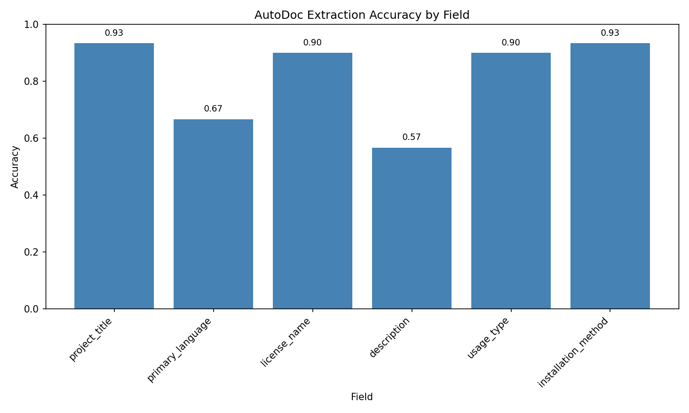
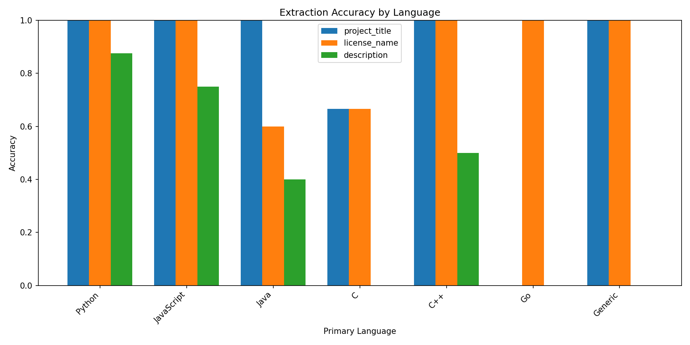

# AutoDoc: Metadata-Driven README Generation for Software Repositories

**Project Type:** Implementation Project
**Course:** INFO 202: Information Organization and Retrieval
**Author:** Divya Jyoti
**Live Deployment:** https://autodoc-h4np.onrender.com
**Repository:** https://github.com/divyajyoti/autodoc

---

## Summary

AutoDoc is an automated documentation system that extracts metadata from software repository configuration files and generates structured README.md files. The system parses package manifests (pyproject.toml, package.json, pom.xml, CMakeLists.txt), normalizes heterogeneous formats into a unified schema, and renders documentation through a templating engine. Deployed as a web application, AutoDoc provides browser-based access without local installation or IDE dependencies. An evaluation across 30 open-source repositories achieved 81.67% overall accuracy, with Python and JavaScript projects reaching 97.9% and 95.8% accuracy respectively. The system implements core INFO 202 concepts including Buckland's information-as-thing framework, vocabulary normalization via controlled vocabularies (SPDX licenses), confidence-based categorization following prototype theory, and provenance tracking for misinformation prevention.

---

## Process and Technical Implementation

### Architecture

AutoDoc implements a four-stage pipeline:

1. **File Discovery**: Recursive directory traversal with category-based classification, respecting .gitignore patterns
2. **Metadata Extraction**: Language-specific extractors parse configuration files with confidence scoring
3. **Schema Normalization**: Heterogeneous formats map to a unified `ProjectMetadata` schema
4. **Markdown Rendering**: Templating engine generates conditional sections based on available data

The extractor hierarchy follows taxonomic organization: `BaseExtractor` serves as an abstract parent, with `PythonExtractor`, `JavaScriptExtractor`, `JavaExtractor`, and `CppExtractor` handling ecosystem-specific manifests. Each assigns confidence levels (EXPLICIT=1.0, STRONG=0.8, REASONABLE=0.6, WEAK=0.4, GUESS=0.2) based on extraction reliability.

### Technical Stack

- **Backend**: Python 3.11 with Flask REST API
- **Deployment**: Render platform with Gunicorn WSGI server
- **External APIs**: GitHub API for repository metadata, Groq API for LLM-enhanced descriptions
- **Parsing**: TOML, JSON, XML parsers with regex fallbacks for less structured formats

---

## Course Concept Integration

AutoDoc frames software repositories as organizing systems composed of heterogeneous informational resources, rather than as monolithic codebases. Each repository is treated as a collection whose members, configuration files, dependency manifests, source directories, and license declarations, encode latent metadata relevant to developer information needs.

The system is grounded in a manually annotated *gold dataset*, which defines the ground-truth metadata schema for repository documentation. Annotations identify user-salient attributes such as project purpose, installation method, execution entry point, runtime dependencies, and licensing. These attributes form a *faceted classification scheme*, where each facet corresponds to a distinct evaluative question rather than a rigid hierarchy, reflecting INFO 202’s view of categorization as a task-oriented design choice.

Extracted facets are represented in a *structured JSON metadata layer*, serving as an intermediate abstraction between heterogeneous repository formats and human-readable output. Metadata is parsed from standardized files (package.json, pyproject.toml, requirements.txt, Dockerfile, LICENSE files) and normalized using controlled vocabularies (e.g., SPDX license identifiers, canonical language names) to reduce vocabulary mismatch and support consistent comparison and retrieval.

Because metadata varies in explicitness, AutoDoc applies *annotation-informed confidence modeling*. Fields directly declared in configuration files receive high confidence, while heuristically inferred values are assigned lower confidence and flagged for review. This treats uncertainty as first-class metadata, acknowledging fuzzy category boundaries rather than presenting automated classification as definitive.

The final README.md is generated by transforming the faceted JSON representation into a *hierarchical document tree*. While the underlying schema remains faceted, the rendered README imposes a deliberate information architecture aligned with common evaluation workflows, progressing from project intent to installation, usage, and licensing, creating a structured navigational surrogate for the repository.

From an information-seeking and information-foraging perspective, AutoDoc reduces cognitive and navigational cost by aggregating dispersed metadata into a single artifact. Strong information cues support orienteering behavior, enabling recognition-based navigation without repeated search or deep directory traversal.

*Evaluation against the gold dataset enables quantitative accuracy assessment and iterative refinement of schema rules and heuristics, while provenance and confidence indicators are preserved for every field*. LLM-generated content is explicitly marked and never treated as authoritative, positioning automation as a sensemaking aid that structures information without replacing human judgment.

---

## Evaluation Results

### Gold Dataset

30 repositories spanning Python (8), JavaScript (8), Java (5), C++ (4), C (3), and Go (1). Each manually annotated for project title, language, description, installation method, usage type, and license.

### Performance

| Metric | Value |
|--------|-------|
| Overall Accuracy | 81.67% |
| Python Projects | 97.9% |
| JavaScript Projects | 95.8% |
| Structural Fields (title, license, install) | 90%+ |

Python and JavaScript achieve near-perfect accuracy on structural fields because pyproject.toml and package.json provide explicit metadata declarations. Languages with less standardized conventions (C, Go) show reduced accuracy; AutoDoc appropriately assigns lower confidence scores and surfaces uncertainty through review markers.

### Figure 1: Accuracy by Field

*Per-field extraction accuracy across 30 repositories. Structural fields achieve 90%+ accuracy.*

### Figure 2: Accuracy by Programming Language

*Python (97.9%) and JavaScript (95.8%) benefit from standardized package manifests.*

### Confidence Validation

| Confidence Level | Mean Accuracy |
|-----------------|---------------|
| EXPLICIT | 94.6% |
| STRONG | 87.1% |
| REASONABLE | 66.7% |
| WEAK | 37.5% |
| GUESS | 20.0% |

Higher confidence correlates strongly with accuracy, validating confidence scoring as a reliability indicator.

---

## AI Usage and Transparency

This project was human-designed and implemented, with AI tools used selectively as development support.

### Division of Work

**Human (Primary):** Problem identification and motivation; scope definition and final design decisions; annotation schema design; manual creation and verification of the gold dataset; core pipeline implementation; evaluation and accuracy improvement (60% to 81.67%); deployment and hosting.

**AI-Assisted:**
- **Planning (Claude):** I used AI as a Project Manager for Sprint planning and milestone breakdown. Effective for structure; required judgment to avoid overgeneralization.
- **Code Development (Claude):** Boilerplate, unit tests, debugging. Particularly valuable for C++ and Java extractors where I lacked domain expertise in CMakeLists.txt and pom.xml parsing conventions. However, AI-generated code sometimes introduced subtle bugs (e.g., incorrect regex patterns for version extraction) and occasionally hallucinated API methods that required manual correction.
- **Runtime Description (Groq/Llama 3):** Used when descriptions were missing. Improved completeness; required schema constraints to prevent generic or inaccurate output.
- **Writing (Claude):** Report structuring. Effective for organization; interpretations remained human-led.

### Human vs AI Contribution

| Component | Human | AI |
|-----------|-------|-----|
| Problem Definition | 100% | 0% |
| Core Algorithms | 85% | 15% |
| Schema Design | 80% | 20% |
| Evaluation Framework | 90% | 10% |
| Gold Dataset Annotation | 100% | 0% |
| Report Writing | 90% | 10% |

AI was effective as a productivity multiplier for planning, boilerplate generation, and debugging. It was not effective as a replacement for human judgment in annotation, evaluation, or system-level decisions.

---

## Conclusion

AutoDoc demonstrates that information organization principles—developed for libraries, archives, and databases—apply directly to software documentation. The system achieves 81.67% overall accuracy across 30 diverse repositories, with structural field extraction exceeding 90% for well-structured Python and JavaScript projects.

Key findings:

1. Standardization enables automation: Projects with standardized manifests (pyproject.toml, package.json) achieve near-perfect extraction accuracy. The vocabulary problem is solved through controlled vocabularies (SPDX licenses, language aliases).

2. Confidence scoring works: The 6-level confidence scale correlates strongly with actual accuracy—EXPLICIT confidence fields are 94.6% accurate, while GUESS confidence drops to 20.0%. This validates confidence as a reliability indicator.

3. Human-in-the-loop remains essential: Even at 81.67% accuracy, 18.33% of extractions require human correction. The system design—with provenance tracking, review markers, and TODO comments—acknowledges this limitation.

4. Information architecture matters: The task-optimized README structure (what → how → use → legal) reflects developer information-seeking behavior. Good organization makes information findable.

AutoDoc embodies the course's central insight: information is only valuable when it's organized, findable, and trustworthy. Software repositories contain vast implicit knowledge; AutoDoc makes that knowledge explicit through principled information organization.

---

## References

Buckland, M. K. (1991). Information as thing. *Journal of the American Society for Information Science*, 42(5), 351-360.

Furnas, G. W., et al. (1987). The vocabulary problem in human-system communication. *Communications of the ACM*, 30(11), 964-971.

Pirolli, P., & Card, S. (1999). Information foraging. *Psychological Review*, 106(4), 643-675.

Rosenfeld, L., Morville, P., & Arango, J. (2015). *Information architecture* (4th ed.). O'Reilly Media.
